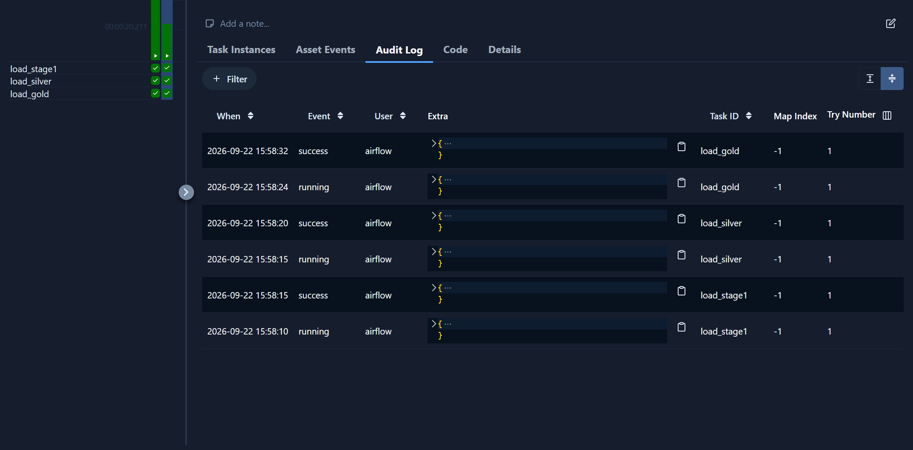
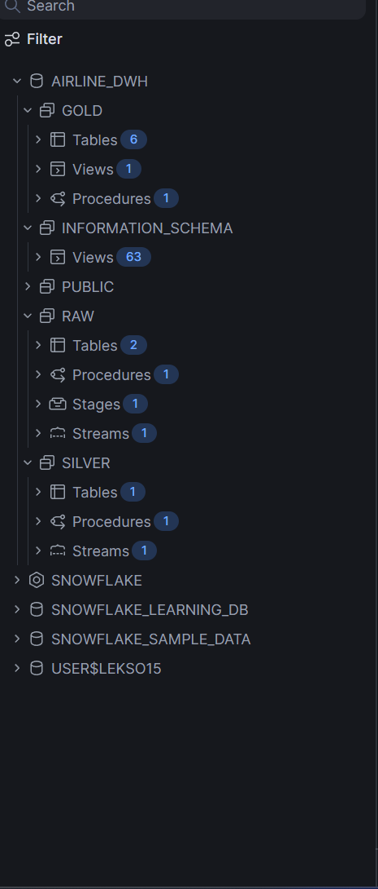

# Snowflake_task1
Creation of small DWH (5-10 tables) 5 with several layer, which will be based on input data and creatine ETL pipeline of processing data into target layer using AIrflow

## Acceptance Criteria

1)Data is processed into DWH through several stages of storage:
2)Data should be loaded in several ways using Airflow:
3)Additional required tasks from the Task Steps section are done 

## Potential Challenges

Design of DWH,  design of ELT/ETL pipeline

## Pipeline 

Created pipeline with raw, silver and gold layers, which was orchestrated by apache airflow. Everything went sucessfull.

 

## Logging 

An audit_log table records every insert/update each procedure performs, captured via RESULT_SCAN(LAST_QUERY_ID()) right after each MERGE/COPY INTO — so every pipeline run leaves a row-count trail per target table.

## Time Travel

Two DDL and two DML queries demonstrate Snowflake's Time Travel: querying a table's past state and restoring an old value via a Time-Travel-backed UPDATE, cloning a table at a past point.Also added dropping and undropping tables.

## Security 
Security

A Secure View (secure_fact_flight_bookings) joins the fact table to dim_passenger and has a Row Access Policy attached on nationality. Verified with a restricted test_analyst role, which sees a filtered subset of rows (2,100) versus the full table as ACCOUNTADMIN (98,260).

## All databases created proof.

